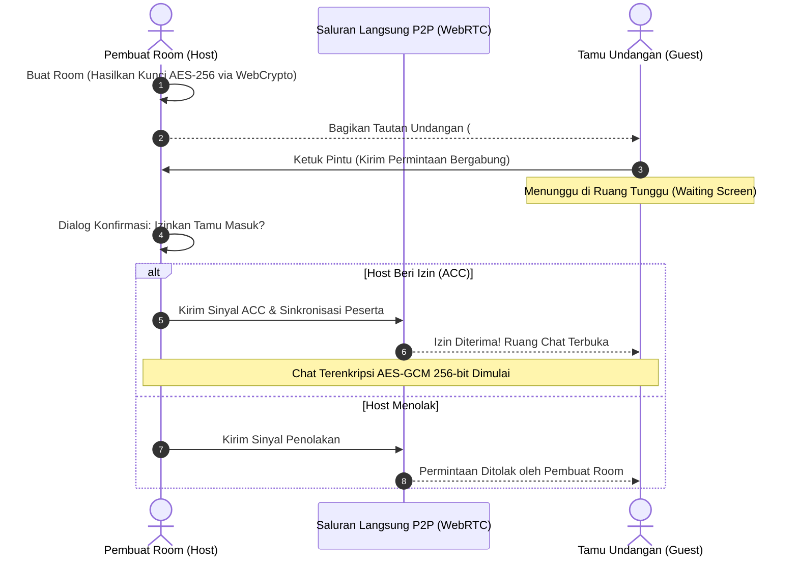

# AnonChat

Aplikasi ruang obrolan sementara realtime yang beroperasi murni **Peer-to-Peer (P2P)**, **100% serverless**, **tanpa database**, dan dilindungi oleh enkripsi berlapis **AES-GCM 256-bit**. Dilengkapi mekanisme perizinan masuk (**Host Knock Approval**) sehingga pembuat room memegang kendali penuh atas siapa saja yang berhak bergabung.

---

## Nilai Inti & Fitur Utama

- **100% Serverless & Nol Database**:
  Komunikasi data mengalir langsung antar peramban melalui **WebRTC DataChannel**. Tidak ada server perantara yang membaca atau menyimpan percakapan. Saat room ditutup, seluruh data musnah permanen dari memori RAM.
- **Sistem Izin Masuk (Host Knock Approval)**:
  Tamu yang membuka tautan undangan tidak bisa langsung membaca chat. Tamu masuk ke antrean tunggu (*Knock*) dan harus disetujui (*ACC*) oleh pembuat room sebelum dapat berpartisipasi.
- **Enkripsi Berlapis (Multi-Layer E2EE)**:
  - Lapisan Jaringan: **WebRTC DTLS / SCTP**
  - Lapisan Aplikasi: **AES-GCM 256-bit** menggunakan **Native Web Crypto API** (`crypto.subtle`) dengan 96-bit random IV dan 128-bit authentication tag. Kunci diturunkan dengan algoritma **PBKDF2 (SHA-256, 100.000 iterasi)**.
- **Verifikasi Anti-Penyusup (Safety Number & Emoji Fingerprint)**:
  Kode angka 6-digit dan 4 emoji unik yang identik di layar kedua pihak untuk memverifikasi keaslian koneksi bebas dari penyadapan (*Man-in-the-Middle*).
- **Pesan Menghilang Otomatis (Vanishing Messages)**:
  Pilihan timer penghapusan mandiri: 30 detik, 1 menit, atau 5 menit. Pesan akan terhapus otomatis dari layar dan memori kedua belah pihak setelah durasi berakhir.
- **Mode Samaran Darurat (Stealth / Panic Mode)**:
  Tekan tombol **Samaran** atau tekan tombol **`Escape` (Esc)** di keyboard untuk mengaburkan (*blur*) seluruh obrolan seketika jika ada orang melintas.
- **Multi-User**:
  Mendukung banyak peserta sekaligus dalam satu room obrolan.
- **Desain Anti-Slop**:
  Dibangun dengan mematuhi filter kualitas **anti-slop** (`miqdadbadjuber/anti-slop`): tanpa orbs glow murahan, tipografi kontras tinggi yang ramah aksesibilitas WCAG AA, dan navigasi keyboard penuh.

---

## Alur Kerja Kriptografi & Knock



---

## Panduan Menjalankan di Komputer Lokal

### Kebutuhan Sistem:
- Node.js versi 18 atau yang lebih baru.

### Langkah Instalasi:
1. Clone repositori ini:
   ```bash
   git clone https://github.com/hmad28/AnonChat.git
   cd AnonChat
   ```

2. Pasang dependensi:
   ```bash
   npm install
   ```

3. Jalankan server pengembangan:
   ```bash
   npm run dev
   ```

4. Jalankan pengujian otomatis (Unit Tests):
   ```bash
   npm test
   ```

5. Buka di browser:
   ```
   http://localhost:5173
   ```

---

## Uji Coba Skenario Izin Masuk (ACC)

1. Buka `http://localhost:5173` di jendela browser utama sebagai **Host**.
2. Masukkan Root Codename Anda (atau biarkan acak), lalu klik **`[ EXECUTE: GENERATE_SECURE_ROOM ]`**.
3. Salin link undangan melalui tombol **`[ SHARE_LINK ]`** di bilah atas.
4. Buka jendela **Incognito / Browser Lain**, lalu tempel link undangan tersebut.
5. Masukkan Callsign tamu lalu klik **`[ INITIATE_KNOCK: REQUEST_ENTRY ]`**.
6. Di layar Host akan muncul notifikasi persetujuan: klik **`[ GRANT_ACCESS ]`** (atau `[ DENY ]` untuk menolak).
7. Kedua peramban langsung terhubung secara P2P dengan enkripsi AES-GCM 256-bit dan kunci langsung tersinkronisasi.

---

## Panduan Deploy ke Vercel (Gratis Selamanya)

Karena aplikasi ini 100% berjalan di sisi peramban (*Client-Side Static SPA*) tanpa perlu backend server sendiri:

1. Buat repository baru di akun GitHub Anda: `https://github.com/hmad28/AnonChat`.
2. Buka dashboard [Vercel](https://vercel.com) dan pilih **Add New Project**.
3. Hubungkan ke repository GitHub `AnonChat`.
4. Vercel akan otomatis mendeteksi konfigurasi **Vite**:
   - Build Command: `npm run build`
   - Output Directory: `dist`
5. Klik tombol **Deploy**. Aplikasi siap diakses secara global dalam hitungan detik.

---

## Struktur Direktori

```
AnonChat/
├── src/
│   ├── components/
│   │   ├── ChatArea.tsx           # Tampilan percakapan terminal, status E2EE, dan burn timer
│   │   ├── ChatInput.tsx          # Prompt input `anon@node:~# `, vanish selector, emoji drawer
│   │   ├── GuyFawkesIcon.tsx      # Ikon vektor minimalis Anonymous / Guy Fawkes mask
│   │   ├── Header.tsx             # Header bar terminal, status E2EE, share link, camo toggle
│   │   ├── KnockModal.tsx         # Panel otorisasi handshake izin masuk tamu untuk root host
│   │   ├── MatrixRain.tsx         # Background canvas animasi rain binary/katakana subtle
│   │   ├── ParticipantSidebar.tsx # Daftar node aktif yang tersinkronisasi di mesh
│   │   └── SecurityModal.tsx      # Dialog inspektur Safety Number & Emoji Anti-MITM
│   ├── pages/
│   │   ├── Home.tsx               # Terminal inisialisasi room baru dan token injector
│   │   └── Room.tsx               # Orkestrator room chat, state P2P, dan life-cycle
│   ├── services/
│   │   └── peerService.ts         # Mesin P2P WebRTC DataChannel star-relay & E2EE cipher
│   ├── utils/
│   │   ├── audio.ts               # Web Audio API synthesizer efek suara retro-futuristik
│   │   ├── clipboard.ts           # Resilient clipboard copy dengan fallback universal
│   │   ├── colors.ts              # Utilitas warna & inisial callsign avatar
│   │   ├── crypto.ts              # Web Crypto API AES-GCM-256, PBKDF2 & Safety Fingerprint
│   │   ├── crypto.test.ts         # Automated Vitest test suite untuk integritas kriptografi
│   │   ├── id.ts                  # Generator token room unik
│   │   └── utils.test.ts          # Automated unit test untuk ID & color utilities
│   ├── App.tsx                    # Komponen root & query hash routing
│   ├── index.css                  # Tailwind v4, CRT scanlines, zero border-radius & glow
│   ├── main.tsx                   # Entry point React
│   └── types.ts                   # Type definitions TypeScript
├── DESIGN.md                      # Spesifikasi desain Cyberpunk Hacker Terminal
├── package.json                   # Dependensi & script test
├── tsconfig.json                  # Konfigurasi TypeScript
├── vite.config.ts                 # Konfigurasi bundler Vite
└── README.md                      # Dokumentasi komprehensif proyek
```

---

## Lisensi

Proyek ini dilisensikan di bawah lisensi [MIT](LICENSE).
